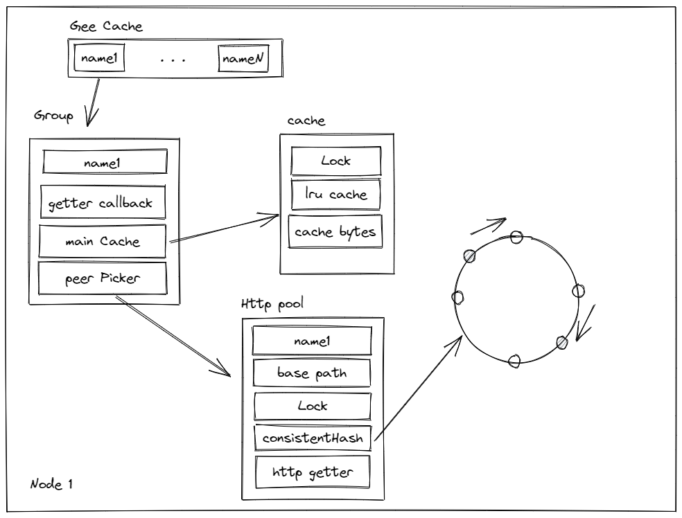

# Gee-Projects
Go学习项目集合

参考极客兔兔教程资料

资料来源: [7天用Go从零实现系列](https://geektutu.com/post/gee.html)

## GeeCache
其中GeeCache的大致结构如下

为了防止缓存击穿，在对一个key的请求`inflight`的时候需要block住其他相同key的请求
`singleflight`结构如下

## Gee
